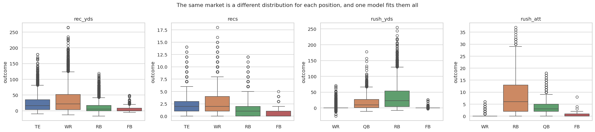
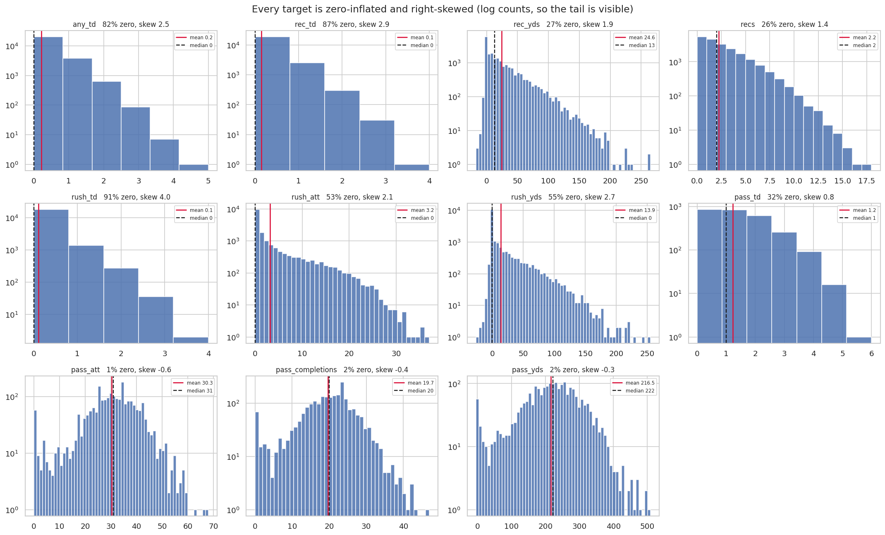
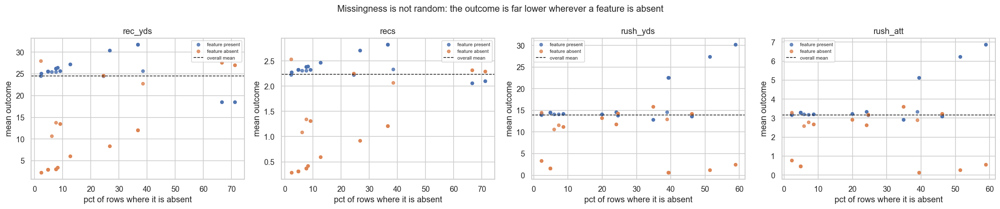
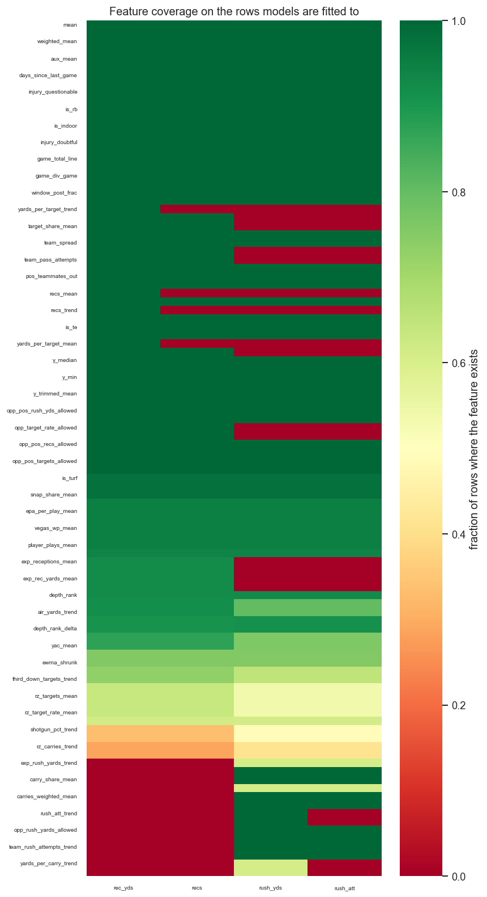
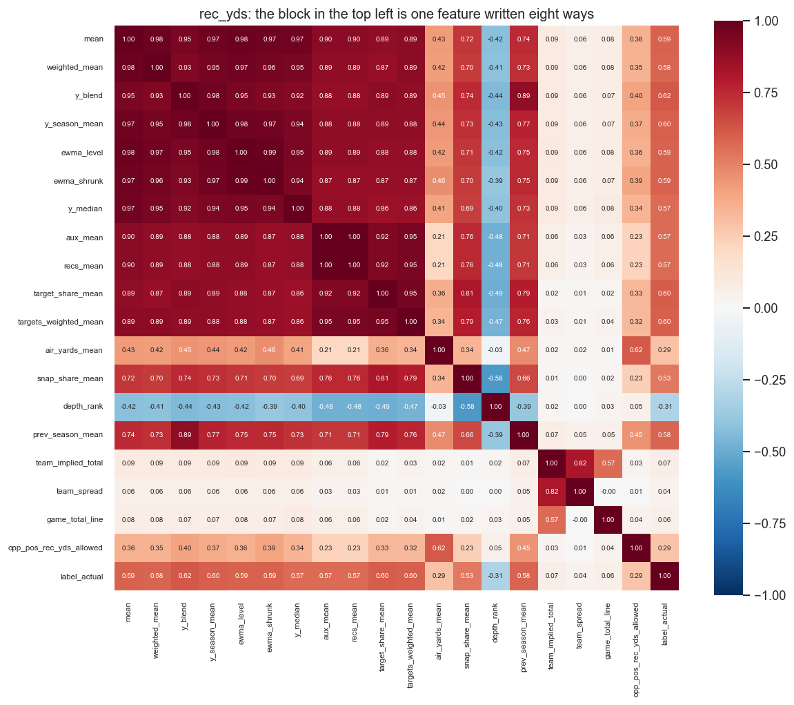
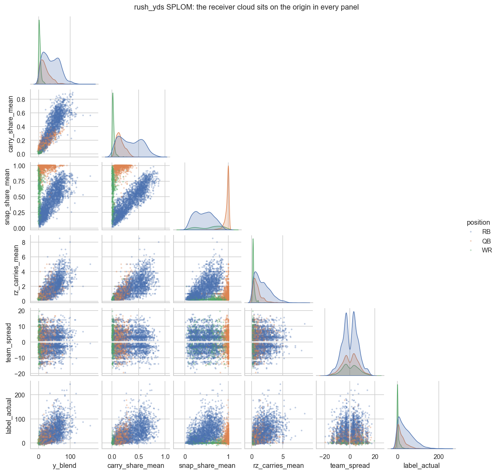
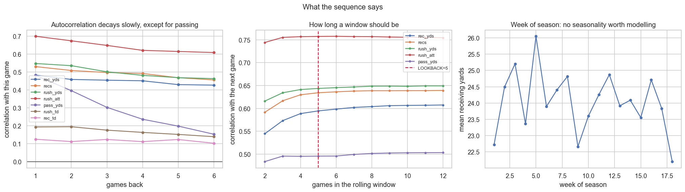
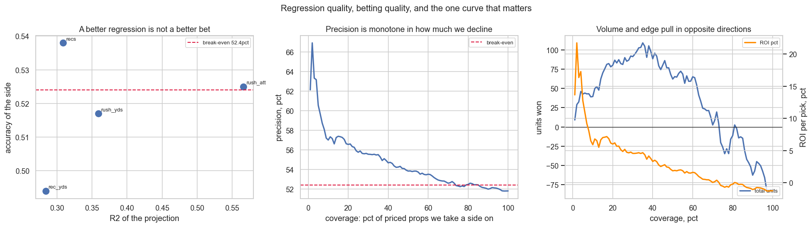
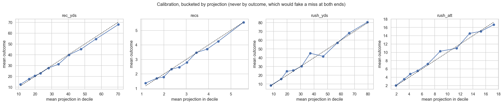

# What the EDA found

I had never done exploratory data analysis on this project. Four years of data,
a hundred and thirty features, eleven markets, forty-odd evaluation scripts, and
not one of them ever asked what was actually in the table. Every script in
`services/training` starts from a hypothesis somebody already had. EDA starts
from nothing and looks.

So I ran one. `services/training/eda.py`, seven sections, twelve figures in this
directory. This is what it turned up, ordered by what it costs me.

Everything below is measured on the rows a model is actually fitted to, which
means `lookback=5`, a graded outcome, and a position the market is eligible for.
That filter matters: the raw table is 179,890 rows and only 151,988 of them are
ever read.

- [The rushing model is mostly wide receivers](#the-rushing-model-is-mostly-wide-receivers)
- [Every target is a mixture and we fit it with one mean](#every-target-is-a-mixture-and-we-fit-it-with-one-mean)
- [Missing is the strongest feature we have and we throw it away](#missing-is-the-strongest-feature-we-have-and-we-throw-it-away)
- [One feature entered eight times](#one-feature-entered-eight-times)
- [The window is the wrong length, in both directions](#the-window-is-the-wrong-length-in-both-directions)
- [A better regression is not a better bet](#a-better-regression-is-not-a-better-bet)
- [Smaller things](#smaller-things)
- [What I am actually going to do](#what-i-am-actually-going-to-do)
- [How to run it](#how-to-run-it)

## The rushing model is mostly wide receivers

The rushing yards model is fitted on 17,971 rows. 9,501 of them are wide
receivers.

    rush_yds        rows     mean    pct zero
    WR             9,501     1.00       87.4
    RB             5,924    34.08       16.8
    QB             2,214    17.43       12.7
    FB               332     1.01       73.8

Fifty-three percent of the training set is a population that averages one yard a
game and gets exactly zero in seven games out of eight. A squared-error loss
spends its effort where the rows are. The rows are not where the board is: no
book prices Jaxon Smith-Njigba's rushing yards, and if one did I would not bet
it.

Rushing attempts is the same picture, 86.8% zero for receivers.

This is not news, exactly. `research_priced_population.py` found the same thing
in September and wrote down the consequence, which is that the top quintile gets
read 24% low and the board turns into an all-unders board. What the EDA adds is
that the fix was never shipped: `eligible_positions` for both rushing markets
still reads `{QB, RB, WR, FB}`. The research is sitting in the repo with no
verdict in its docstring and the defect it describes is still live.



## Every target is a mixture and we fit it with one mean

    market               n     mean   pct zero   skew   top decile share
    any_td          24,520     0.22       81.5   2.49        61.2
    rec_td          21,861     0.15       86.7   2.89        78.0
    rush_td         19,482     0.11       91.3   3.97       100.0
    rush_yds        17,971    13.93       54.7   2.69        59.2
    rush_att        17,971     3.16       53.5   2.13        53.6
    rec_yds         20,429    24.55       26.8   1.87        39.3
    recs            20,429     2.23       26.2   1.37        32.9
    pass_yds         2,222   216.49        2.3  -0.32        16.6

Read the zero column down and the skew column across. These are not continuous
quantities with noise around a mean. They are two populations stapled together:
a point mass at zero for the players who did not get the ball, and a long right
tail for the ones who did. Rushing touchdowns are 91% zero and the entire league
total comes out of the top decile of rows.

Squared error assumes a symmetric, constant-variance error around a single
central value. There is no single central value here. The fitted number lands
between the two populations at a value that almost never occurs.

I already know this and already fixed it once. `pass_td` runs `pois_v4` with a
Poisson deviance loss, and the note in `train.py` says exactly why: it cut the
held-out shortfall from 11.2% to 1.5% while MAE did not move at all. The other
three touchdown markets, `rush_td`, `rec_td` and `any_td`, still run `rf_v10`,
which is a RandomForest minimising squared error on a target that is nine-tenths
zeros. The argument that won for passing touchdowns applies verbatim and nobody
carried it across.

The other half of this table is the Tukey outlier count, which flags 13% of
rushing yards rows as outliers. That is the convention misfiring on a skewed
non-negative stat, not dirty data. Every one of those values is a real game a
real player had. Nothing here should be trimmed, and I am writing that down once
so that no future version of me "cleans" it.



## Missing is the strongest feature we have and we throw it away

`train.py` fills an absent feature with 0.0. So do both serving paths. There is
no indicator column anywhere, so by the time a model sees the matrix there is no
difference between "this player had no red-zone carries" and "this player had
zero red-zone carries."

Those are not the same statement, and the gap between them is enormous:

    rush_att            absent     y when present     y when absent    ratio
    exp_rush_yards       39.4%               5.13              0.13    38.9x
    shotgun_pct          51.3%               6.23              0.26    24.0x
    rz_carries           58.8%               6.87              0.57    12.1x

31 of the 34 partially-absent features on `rec_yds` differ on the outcome at
p < 0.001, and the same on `recs`. In the language of the missing-data taxonomy
this is nowhere near MCAR; it is not even MAR. The probability a feature is
missing depends on the value of the thing I am trying to predict, which is MNAR,
the hard case.

Except here it is not a data-quality problem at all. A red-zone carry average is
absent because the player had no red-zone carries, which is precisely the fact
that he is not the guy. The missingness is not a hole in the data. It is among
the strongest signals in it.

A tree can partly recover this, because a zero in a strictly positive column is
itself a splittable value. A linear model cannot: to an elastic net a zero is
just a small number on the same slope. `recs` runs `enet_v2`. So the market
where this costs the most is the one least able to see it.




## One feature entered eight times

    rush_att: 77 usable features
      pairs above |r| 0.95: 80      above 0.99: 19      exact duplicates: 3
        +1.0000   mean               ~  aux_mean
        +1.0000   trend              ~  aux_trend
        +1.0000   weighted_mean      ~  carries_weighted_mean

`aux_mean` is never its own feature. It is `recs_mean` on receiving yards,
`rush_att_mean` on rushing yards, and on rushing attempts it is a copy of `mean`
itself. Not correlated with. Identical to, at r = 1.0000 to four places.

Then the softer version of the same thing. The top of every correlation table is
`y_blend`, `y_season_mean`, `ewma_level`, `ewma_shrunk`, `mean`, `weighted_mean`,
`y_median`, `y_trimmed_mean`. Eight ways of writing down how much the player has
been doing lately, all correlated above 0.97 with each other, each correlating
0.59 to 0.85 with the outcome.

PCA puts a number on it:

    market      columns   80%   90%   95%     PC1
    rec_yds          86    26    37    45   22.5%
    recs             82    26    36    43   21.8%
    rush_yds         85    28    38    46   24.0%
    rush_att         81    26    36    43   24.8%

Twenty-six components carry eighty percent of the variance of eighty-six
columns, and the first one alone is over a fifth. That first component is the
how-good-is-this-player axis. There is one strong feature in this dataset and
eighty-odd columns arguing over the remainder.

This matters in two concrete ways. A random forest with `max_features="sqrt"`
draws a random subset of columns at every split, so a quantity present under
three names gets drawn three times as often as it deserves. And a feature
importance table splits its credit across the copies, which is how something can
look weak in SHAP while being the thing the model is standing on. I have already
been fooled by exactly that once, on the `recs` SHAP alarm in September that
turned out to be elastic-net collinearity.




## The window is the wrong length, in both directions

How much a player's own past predicts his next game, within a season:

    market          lag1   lag2   lag3   lag4   lag5   lag6    roll5   roll8   season
    rush_att       0.699  0.674  0.648  0.621  0.615  0.609    0.757   0.757    0.753
    rush_yds       0.547  0.535  0.501  0.481  0.468  0.463    0.644   0.649    0.649
    recs           0.530  0.508  0.497  0.492  0.468  0.456    0.634   0.639    0.639
    rec_yds        0.482  0.458  0.454  0.451  0.429  0.427    0.594   0.604    0.607
    pass_yds       0.480  0.396  0.303  0.236  0.198  0.153    0.496   0.501    0.503
    rush_td        0.193  0.194  0.175  0.163  0.152  0.139    0.291   0.297    0.302
    rec_td         0.125  0.112  0.123  0.111  0.123  0.102    0.208   0.217    0.216

Three things.

The decay is nearly flat for skill players. Receiving yards go from 0.48 one
game back to 0.43 six games back. Last week is barely worth more than a month
ago. That is a hard ceiling on what recency weighting can buy, and it explains
why `weighted_mean` and `mean` correlate at 0.98 and predict identically.

Passing yards go the other way, 0.48 down to 0.15 by six games back. A
quarterback's recent form is real and his old form is nearly worthless. We run
one `LOOKBACK` of five for every market. That is too long for quarterbacks and
slightly short for the receiving markets, where season-to-date edges a five-game
window, though never by more than 0.013. Rushing attempts is the exception that
goes the other way and prefers the shorter window.

And touchdowns barely autocorrelate at all. 0.125 for receiving scores. That is
not a modelling failure waiting on a better feature, that is the ceiling. Who
scores is close to a coin weighted by volume, which is the argument for a rate
model rather than a yardage model, and the argument against ever expecting much
from these markets.



## A better regression is not a better bet

This is the part I actually wanted to know, and it is the cleanest result in the
whole exercise. Same walk-forward predictions, both scorecards:

    market      n       R2     MAE   accuracy   P over   R over   F1 over   P under
    recs     2387    0.309    1.47      0.538    0.499    0.648     0.563     0.597
    rec_yds  2267    0.284   20.42      0.494    0.487    0.812     0.608     0.523
    rush_yds 1029    0.359   20.72      0.517    0.493    0.690     0.575     0.565
    rush_att  969    0.566    3.20      0.525    0.453    0.421     0.436     0.575

`rush_att` has the best regression on the board by a mile, R2 0.566, and close to
the worst accuracy. `recs` has half that R2 and the best accuracy. Across the
four markets the rank correlation between R2 and accuracy is +0.40 on four
points, which is nothing.

The reason is not subtle once it is written down. A regression is graded on
distance from the outcome. A bet is graded on which side of one specific number
you land. The book sets that number near the middle of the predictive
distribution, which is exactly where the density is highest, so it is exactly
the place where shaving the average error moves the fewest decisions. Cutting
MAE by 20% can move zero picks.

And betting everything loses:

    accuracy 0.518   over P 0.488 R 0.681 F1 0.569
                     under P 0.573 R 0.375 F1 0.453

51.8% against a 52.4% break-even at -110. On all 6,652 walk-forward priced props
the model is a losing bet. Everything this product earns, it earns by declining.

    coverage   picks   |z| at least   precision   vs 52.4%      ROI   units
       100%    6,652           0.00       51.8%      -0.6%    -1.2%   -81.9
        75%    4,989           0.14       52.3%      -0.1%    -0.5%   -26.1
        50%    3,326           0.30       53.8%      +1.4%    +1.9%   +62.1
        35%    2,328           0.43       55.5%      +3.1%    +4.7%  +109.0
        25%    1,663           0.56       55.7%      +3.3%    +4.9%   +81.0
        15%      997           0.75       57.4%      +5.0%    +7.0%   +70.1
         7%      465           1.06       58.7%      +6.3%    +9.2%   +42.9
         5%      332           1.21       60.5%      +8.1%   +12.8%   +42.5
         3%      199           1.45       63.3%     +10.9%   +16.4%   +32.5
         2%      133           1.66       66.9%     +14.5%   +21.7%   +28.9

Precision is monotone in how much I decline. Total units peak at 35% coverage
(+109.0). Return per pick peaks at 2% (+21.7%). The live board sits near a
fifth, between the two.

So on the question of balancing R2, F1, accuracy, precision and recall: there is
no balance to strike, because they are not competing for the same thing.

Recall is a cost here, not a benefit. In the expected-cost framing,
E[cost] = P(FP) x C_FP + P(FN) x C_FN, a false positive is a bet I place and
lose, costing one unit. A false negative is a bet I never place, costing zero.
With C_FN at zero there is no recall term to trade against. F1 is the harmonic
mean of precision and recall, so it actively punishes declining to bet: push F1
up and it pushes coverage toward 100%, which is the row that loses 81.9 units.
Optimising F1 here would be optimising for the thing that makes me poorer.

R2 is not the goal either, but it is not decoration. It is the ingredient. The
gap that drives selection is a projection minus a line, so an unbiased and
well-spread projection is what makes the gap mean anything. The right way to
read them together: R2 buys nothing directly, precision at a chosen coverage is
what pays, and the only real tradeoff is precision against volume, which is a
business decision rather than a statistical one.




## Smaller things

**21,980 dead rows.** Every `lookback=8` row in the table, built by a feature
generation that predates 71 of the current features. Nothing reads them. They
inflate every naive missingness statistic, which is what sent me down a wrong
path for twenty minutes before I checked which rows training actually touches.

**A train/serve skew on `recs_mean`.** The table columns `recs_mean` and
`recs_trend` are NULL on all 179,890 rows. The JSON keys of the same name are
not. `vote_v1_rec_yds`, the live model for the biggest market, trains on the
JSON values and both serving paths read the table columns and hand it 0.0
instead, at `build_projections.py:266` and `build_prop_edges.py:1580`. That is a
real train/serve skew and I measured it before saying anything: zeroing both
features shifts the prediction by -0.66 yards on average and 4.6 at the worst
row, and MAE is actually a hair better served than trained. So it is a landmine
rather than a leak. Worth fixing because the next feature that lands in `base`
by the same route might matter, not because this one does.

**No season drift.** Receiving yards fell 6.0% in 2025 and came back 4.1% above
the 2022 level in 2026. Rushing yards are down 8.0% from 2022 but were up 0.8%
in 2024. The swings are season-specific and not directional, which means a drift
correction fitted on any two seasons is fitting noise. I have a note in my own
memory saying production falls about 3% a year. On the targets, that is not
there.

**Positions are one model.** Every market pools its eligible positions into a
single fit, and the box plots show four different distributions per market. The
position one-hots let a tree separate them; they do not let a linear model do
much.

## What I am actually going to do

In order of expected value, and none of it ships without beating the incumbent
on data it was never fitted to. The first two are not discoveries at all.
They are things this repo already proved and never carried across, which is
the part of this exercise I find least comfortable.

1. **Restrict the rushing markets to the priced positions.** The research is
   already written and the defect is still live. This is a one-line change to
   `eligible_positions` and a retrain.
2. **Poisson for the other three touchdown markets.** `pass_td` already proved
   it. `rush_td`, `rec_td` and `any_td` are 82 to 91 percent zero and still on
   squared error.
3. **Missingness indicators.** An `_is_missing` companion column for every
   partially-absent feature, so the fact that carries the 12x to 39x signal is
   available to the linear families instead of only inferrable by the trees.
4. **Drop the exact duplicates.** `aux_mean` and `aux_trend` are copies in every
   market. Removing them costs nothing and stops the forest double-drawing one
   quantity.
5. **Per-market lookback.** Five is wrong for quarterbacks in one direction and
   for everyone else in the other. The curve in figure 10 says what each market
   wants.

Number 3 is the one I expect most from, and also the one most likely to measure
as nothing, because a tree can already split on a zero. If it does measure as
nothing I will write that down here rather than quietly keep it.

## How to run it

```bash
docker compose run --rm training python eda.py
```

Or one section at a time. Sections 1 to 6 read the database and nothing else and
take under a minute. Section 7 trains models through `backtest_gap_system` and
takes about four.

```bash
docker compose run --rm training python eda.py 1 2 3
```

`EDA_CACHE` points at a directory where the loaded frames are pickled, which
makes re-runs instant. `EDA_OUT` is where the figures land, defaulting here.

EDA is not a gate you pass once. The data science loop comes back to it every
time the data changes, and everything above had been live for months.
